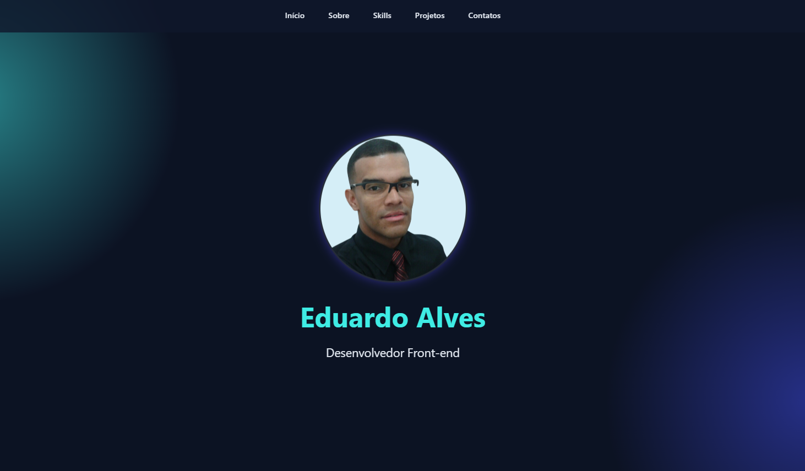

# 🚀 Portfólio - DuDev

Portfólio pessoal desenvolvido com HTML, CSS e JavaScript puro, apresentando meus projetos, habilidades e formas de contato.

🔗[Acesse o projeto](https://portfolio-dudev.vercel.app/)

---

## 📸 Preview



---

## ✨ Funcionalidades

- **Navegação fixa com scroll suave** — menu sempre visível no topo com animação de sublinhado nos links
- **Menu hamburguer** — navegação responsiva para dispositivos móveis com animação de abertura/fechamento
- **Seção Hero** — foto de perfil com animação de flutuação contínua
- **Seção Sobre** — apresentação pessoal com efeito glassmorphism
- **Seção Skills** — cards com ícones das tecnologias utilizadas
- **Seção Projetos** — grade responsiva com cards de projetos, imagem, descrição e link
- **Formulário de contato via WhatsApp** — mensagem pré-formatada enviada diretamente ao WhatsApp com validação de campos
- **Botões de redes sociais** — links para LinkedIn, GitHub, e-mail e download do currículo em PDF
- **Ano automático no rodapé** — sempre atualizado via JavaScript
- **Fundo decorativo** — gradiente radial fixo que cria efeito de brilho nos cantos

---

## 🎨 Design

- Tema escuro com paleta em **ciano (`#3fece4`)** e **azul/roxo (`#3d48e2`)**
- Efeito **glassmorphism** nas caixas e cards (backdrop-filter + fundo semitransparente)
- Animações suaves de **hover** em todos os elementos interativos
- Layout totalmente **responsivo** (desktop, tablet e mobile)

---

## 🛠️ Tecnologias utilizadas


---

## 📁 Estrutura do projeto

```
portfolio-dudev/
├── assets/
│   ├── Eduardo.png
│   ├── Eduardo-Alves-CV.pdf
│   ├── Conversor-de-moedas.png
│   ├── Cronometro.png
│   ├── Dev-Burger.png
│   ├── Dev-sorteio.png
│   ├── Jokenpo.png
│   ├── Mario-e-Luigi.png
│   ├── Pomodoro.png
│   └── Quadro-de-metas.png
├── index.html
├── style.css
├── script.js
└── README.md
```

---

## 📱 Responsividade

| Breakpoint | Layout |
|---|---|
| > 1024px | Desktop completo |
| ≤ 1024px | Grid de projetos ajustado |
| ≤ 768px | Menu hamburguer, layout em coluna |
| ≤ 480px | Redes sociais em grade 2x2, padding reduzido |
| ≤ 360px | Redes sociais em coluna única |

---

## 🚀 Como executar localmente

```bash
# Clone o repositório
git clone https://github.com/eduardoadf-dev/portfolio-dudev.git

# Acesse a pasta
cd portfolio-dudev

# Abra o arquivo no navegador
# Basta abrir o index.html diretamente ou usar a extensão Live Server no VS Code
```

---

## 📬 Contato

- 💼 [LinkedIn](https://www.linkedin.com/in/eduardoadf/)
- 🐙 [GitHub](https://github.com/eduardoadf-dev)
- 📧 eduardoadf2020@gmail.com

---

<p align="center">Desenvolvido por <strong>DuDev</strong></p>
